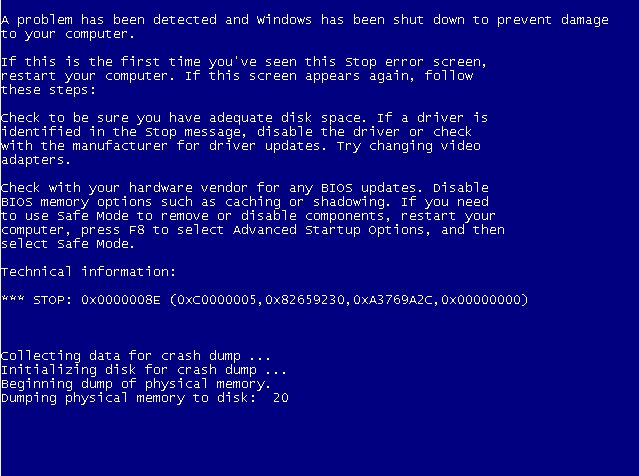

## Advanced SystemCare 13.2 Kernel vulnerabilities

BSOD POC's for (Advanced SystemCare 13.2) AscRegistryFilter.sys **(CVE-2020-10234)**

----

## About
* **Description:** <br>
Advanced SystemCare 13.2 is a anti-virus/threat detectiong software provided by IObit. The version 13.2.0 includes multiple drivers, one of which, (AscRegistryFilter.sys) is prone to multiple vulnerabilities. 
----
## CVE-2020-10234
* **Description:** <br>
AscRegistryFilter Windows x86 Kernel Driver allows unprivileged user's unrestricted access while sending IOCTL's to the associated device driver. While utilizing `DeviceIoControl()`, if the user provides a NULL entry for the `dwIoControlCode` parameter. It will result in a BSOD ak.k.a Kernel-Panic.
<br>

* **POC exploit:** <br>
An unprivileged user can send one of the listed IOCTL's found below. These IOCTL codes can be found in the dispatch_function while reverse-engineering the driver with IDA Pro. The BSOD POC in this repository uses the first IOCTL code `0x8001E000`. Bound with a NULL buffer.
<br>

```
Address    | IOCTL Code | Device                                     | Function   | Method                 | Access
0x11847    | 0x8001E000 | <UNKNOWN>     0x8001     | 0x800      | METHOD_BUFFERED   0    | FILE_READ_ACCESS | FILE_WRITE_ACCESS (3)
0x11852    | 0x8001E004 | <UNKNOWN>     0x8001     | 0x801      | METHOD_BUFFERED   0    | FILE_READ_ACCESS | FILE_WRITE_ACCESS (3)
0x1185D    | 0x8001E008 | <UNKNOWN>     0x8001     | 0x802      | METHOD_BUFFERED   0    | FILE_READ_ACCESS | FILE_WRITE_ACCESS (3)
0x11868    | 0x8001E00C | <UNKNOWN>     0x8001     | 0x803      | METHOD_BUFFERED   0    | FILE_READ_ACCESS | FILE_WRITE_ACCESS (3)
0x11873    | 0x8001E010 | <UNKNOWN>     0x8001     | 0x804      | METHOD_BUFFERED   0    | FILE_READ_ACCESS | FILE_WRITE_ACCESS (3)
0x1187E    | 0x8001E014 | <UNKNOWN>     0x8001     | 0x805      | METHOD_BUFFERED   0    | FILE_READ_ACCESS | FILE_WRITE_ACCESS (3)
0x11B09    | 0x8001E020 | <UNKNOWN>     0x8001     | 0x808      | METHOD_BUFFERED   0    | FILE_READ_ACCESS | FILE_WRITE_ACCESS (3)
0x11B14    | 0x8001E024 | <UNKNOWN>     0x8001     | 0x809      | METHOD_BUFFERED   0    | FILE_READ_ACCESS | FILE_WRITE_ACCESS (3)
0x11B1F    | 0x8001E040 | <UNKNOWN>     0x8001     | 0x810      | METHOD_BUFFERED   0    | FILE_READ_ACCESS | FILE_WRITE_ACCESS (3)
0x11B2A    | 0x8001E044 | <UNKNOWN>     0x8001     | 0x811      | METHOD_BUFFERED   0    | FILE_READ_ACCESS | FILE_WRITE_ACCESS (3)
0x11B35    | 0x8001E048 | <UNKNOWN>     0x8001     | 0x812      | METHOD_BUFFERED   0    | FILE_READ_ACCESS | FILE_WRITE_ACCESS (3)
```

**Driver Device names:**

```
\DosDevices\AscRegistryFilter
\Device\AscRegistryFilter
```
----



----

* **Disclosure timeline:** <br>
1. Mar 8, 2020 -  Contacted vendor via support email
2. Nothing happened
